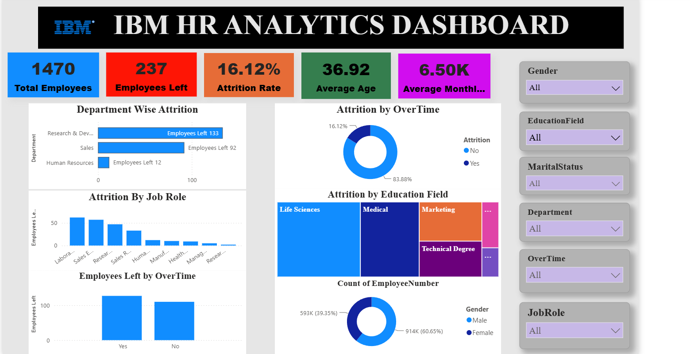

# 📊 IBM HR Analytics Dashboard (Power BI)

## 📌 Project Overview

This project is an interactive HR Analytics Dashboard developed using Microsoft Power BI. The dashboard helps analyze employee attrition, workforce demographics, education, job roles, and other HR metrics through interactive visualizations.

---

## 🛠️ Tools & Technologies

- Microsoft Power BI
- Microsoft Excel
- Power Query
- DAX
- Data Visualization

---

## 📈 Dashboard Features

- Total Employees KPI
- Employees Left KPI
- Attrition Rate
- Average Age
- Average Monthly Salary
- Department-wise Attrition
- Attrition by Job Role
- Attrition by Education Field
- Gender Distribution
- Interactive Slicers

---

## 📷 Dashboard Preview

> Upload your screenshot as **Dashboard_Screenshot.png** in this repository.

```md

```

---

## 📂 Repository Files

- Dashboard.pbix
- Dashboard_Screenshot.png
- HR_Analytics_Dataset.xlsx

---

## 🎯 Key Insights

- Employee attrition across departments
- Gender distribution analysis
- Education-wise employee distribution
- Job role attrition analysis
- Interactive HR performance monitoring

---

## 🚀 Skills Demonstrated

- Power BI Dashboard Design
- Data Cleaning
- Data Modeling
- DAX Measures
- Power Query
- Business Intelligence
- Data Visualization

---

## 👨‍💻 Author

**Asokan R**

- GitHub: https://github.com/asokanr


---

⭐ If you found this project useful, feel free to star this repository.
